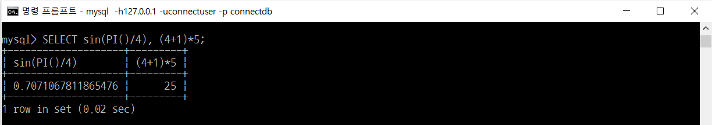
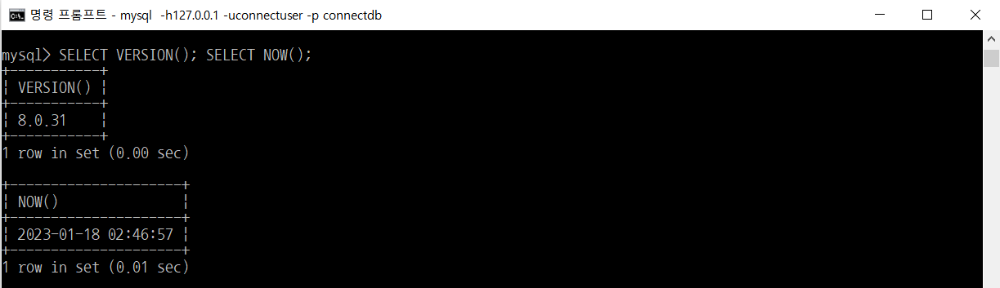
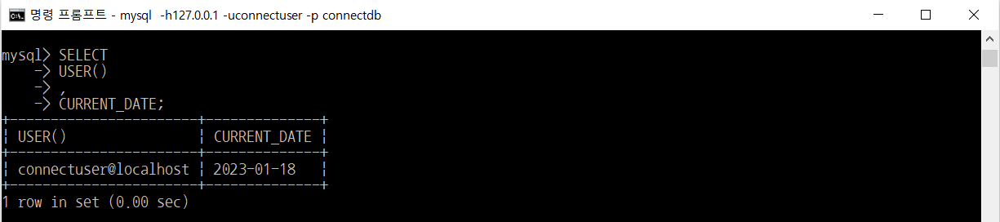
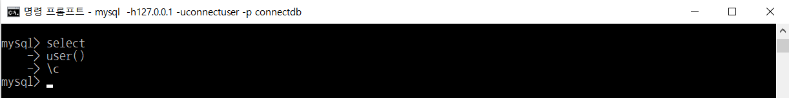
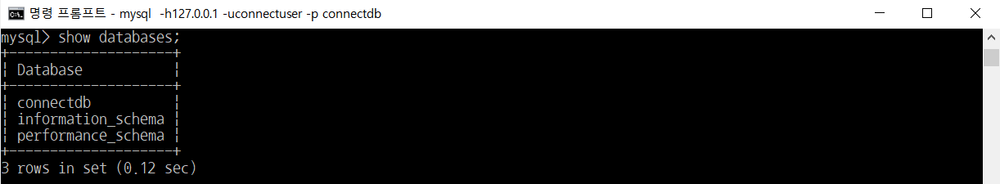
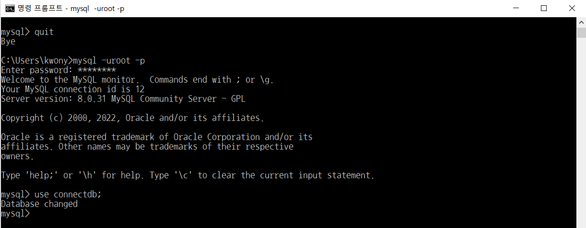

# SQL 개념

> 부스트코스의 무료강의 중 웹 백엔드 강의를 수강하고 정리한 내용입니다.

[부스트코스 사이트](https://www.boostcourse.org/opencourse)

<br>

---

<br>

## **SQL (Structured Query Language)**

- 구조화된 쿼리 언어
- 데이터를 보다 쉽게 검색하고 추가, 삭제, 수정 같은 조작을 할 수 있도록 고안된 컴퓨터 언어
- 관계형 데이터베이스에서 데이터를 조작하고 쿼리하는 표준 수단
- DML(조작어), DDL(정의어), DCL(제어어)로 나누어짐
- **DML (Data Manipulation Language)** : 데이터를 조작하기 위해 사용
    - `INSERT`, `UPDATE`, `DELETE`, `SELECT` 등
- **DDL (Data Definition Language)** : 데이터베이스의 스키마를 정의하거나 조작하기 위해 사용
    - `CREATE`, `DROP`, `ALTER` 등
- **DCL (Data Control Language)** : 데이터를 제어(권한 관리, 데이터의 보안·무결성 등 정의)하기 위해 사용
    - `GRANT`, `REVOKE` 등

<br>

---

<br>

## **SQL 쿼리문의 특징**

### **키워드는 대소문자를 구별하지 않는다**

다음 쿼리들은 모두 같은 쿼리이다

```
mysql> SELECT VERSION(), CURRENT_DATE;
mysql> select version(), current_date;
mysql> SeLeCt vErSiOn(), current_DATE;
```

<br>

### **쿼리를 이용해 계산식의 결과를 구할 수 있다**

함수 및 수식 사용 예제



<br>

### **여러 문장을 한 줄에 연속으로 붙여서 실행가능하다**

각 문장에 세미콜론(;)만 붙여주면 된다



<br>

### **하나의 SQL은 여러 줄로 입력가능하다**

MySQL은 문장의 끝을 라인으로 구분하는 것이 아니라 세미콜론(;)으로 구분하기 때문에

여러 줄에 거쳐 문장을 쓰는 것도 가능하다



<br>

### **SQL을 입력하는 도중에 취소할 수 있다**

긴 쿼리를 작성하다가 중간에 취소해야 하는 경우에는 즉시 `\C` 를 붙여주면 된다



<br>

### **DBMS에 존재하는 데이터베이스 확인하기**

현재 서버에 존재하는 데이터베이스를 찾아보기 위해서 `SHOW` statement를 사용한다



<br>

### **사용중인 데이터베이스 전환하기**

Database를 선택하기 위해 `use` command를 사용한다

데이터베이스를 전환하려면, 이미 데이터베이스가 존재해야 하며,

현재 접속 중인 계정이 해당 데이터베이스를 사용할 수 있는 권한이 있어야 한다

