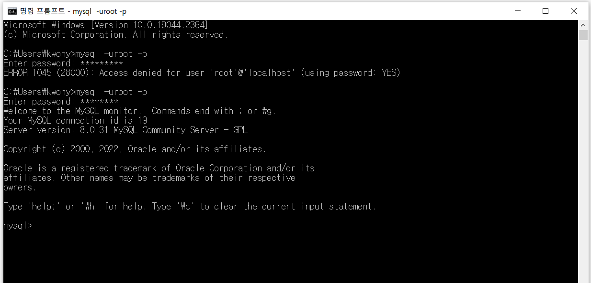
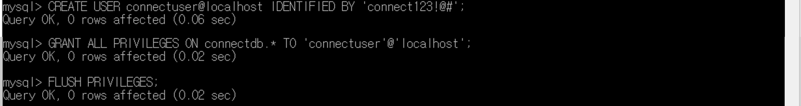
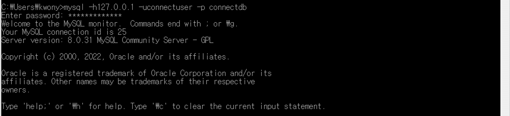
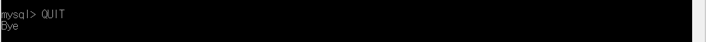

# MySQL에서 Database 생성, 사용자 생성 및 권한 부여, 연결 끊기

> 부스트코스의 무료강의 중 웹 백엔드 강의를 수강하고 정리한 내용입니다.

[부스트코스 사이트](https://www.boostcourse.org/opencourse)

<br>

---

<br>

## **SQL (Structured Query Language)**

- 구조화된 쿼리 언어
- 데이터를 보다 쉽게 검색하고 추가, 삭제, 수정 같은 조작을 할 수 있도록 고안된 컴퓨터 언어
- 관계형 데이터베이스에서 데이터를 조작하고 쿼리하는 표준 수단
- DML(조작어), DDL(정의어), DCL(제어어)로 나누어짐
- **DML (Data Manipulation Language)** : 데이터를 조작하기 위해 사용
    - `INSERT`, `UPDATE`, `DELETE`, `SELECT` 등
- **DDL (Data Definition Language)** : 데이터베이스의 스키마를 정의하거나 조작하기 위해 사용
    - `CREATE`, `DROP`, `ALTER` 등
- **DCL (Data Control Language)** : 데이터를 제어(권한 관리, 데이터의 보안·무결성 등 정의)하기 위해 사용
    - `GRANT`, `REVOKE` 등

<br>

---

<br>

## **Database 생성하기**

<br>

**1\. MySQL 관리자 계정인 root로 데이터베이스 관리 시스템에 접속**

```
mysql –uroot -p
```

윈도우 사용자의 경우 비밀번호를 입력하라고 나옴 (MySQL 설치 시 설정한 비밀먼호 입력)



<br>

**2\. Database 생성**

```
create database DB이름;
```

'DB이름' 부분에 데이터베이스 이름을 넣으면 됨

세미콜론(;) 붙여야 함


<br>

## **Database 사용자 생성과 권한 주기**

해당 데이터베이스를 사용하는 계정을 생성하고,

해당 계정이 데이터베이스를 이용할 수 있는 권한을 줘야 한다.

<br>

**1\. 사용자 생성**

```
CREATE USER 계정이름@'%' IDENTIFIED BY '암호';
```

- **@'%'**  
    : 어떤 클라이언트에서든 접근 가능하다는 의미

```
CREATE USER 계정이름@'localhost' IDENTIFIED BY '암호';
```

- **@'localhost'**  
    : 해당 컴퓨터에서만 접근 가능하다는 의미

<br>

**2\. 권한 부여**

```
GRANT ALL PRIVILEGES ON db이름.* TO '계정이름'@'%';
```

```
GRANT ALL PRIVILEGES ON db이름.* TO '계정이름'@'localhost';
```

- **\*** ( db 이름 뒤에 있는 \* )  
    : 모든 권한을 의미

<br>

**3\. DBMS에 적용**

```
flush privileges;
```

- **flush privileges;**  
    : DBMS에 적용하라는 의미로, 반드시 실행해줘야 함



<br>

## **생성한 Database에 접속하기**

```
mysql -h호스트명 -uDB계정명 -p 데이터베이스이름
```

> db이름이 connectdb, db계정명이 connectuser, 암호가 connect123!@# 일 경우  
> 
> ```
> mysql -h127.0.0.1 -uconnectuser -p connectdb​
> ```
> 
> (맨 뒤에 세미콜론을 붙이지 않아야 한다)



<br>

## **MySQL 연결 끊기**

`QUIT` 또는 `exit` 사용



