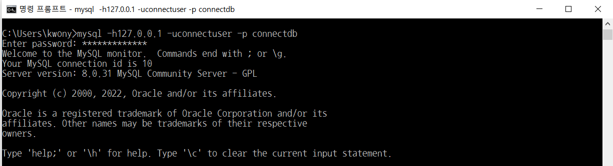
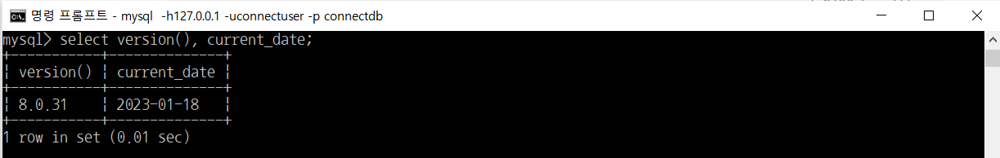

# [웹 백엔드] MySQL 버전과 현재 날짜 구하기

> 부스트코스의 무료강의 중 웹 백엔드 강의를 수강하고 정리한 내용입니다.

[부스트코스 사이트](https://www.boostcourse.org/opencourse)

<br>

---

<br>

### **1\. 데이터베이스에 접속**

```
mysql -h호스트명 -uDB계정명 -p 데이터베이스이름
```

> db이름이 connectdb, db계정명이 connectuser, 암호가 connect123!@# 일 경우  
> 
> ```
> mysql -h127.0.0.1 -uconnectuser -p connectdb​
> ```
> 
> (맨 뒤에 세미콜론을 붙이지 않아야 한다)



<br>

### **2\. MySQL 버전과 현재 날짜를 보여주는 쿼리 입력**

```
select version(), current_date;
```



- 프롬프트에서 SQL 입력
- SQL은 세미콜론(;)으로 끝남
- SQL은 쿼리(Query)라고 읽음
- 쿼리 : DBMS에 명령을 내릴 때 사용하는 문장
- SELECT : 어떤 내용을 조회할 때 사용하는 키워드
- MySQL은 쿼리에 해당하는 결과의 전체 row를 출력하고 마지막에 전체 row 수와 쿼리 실행에 걸린 시간 표시