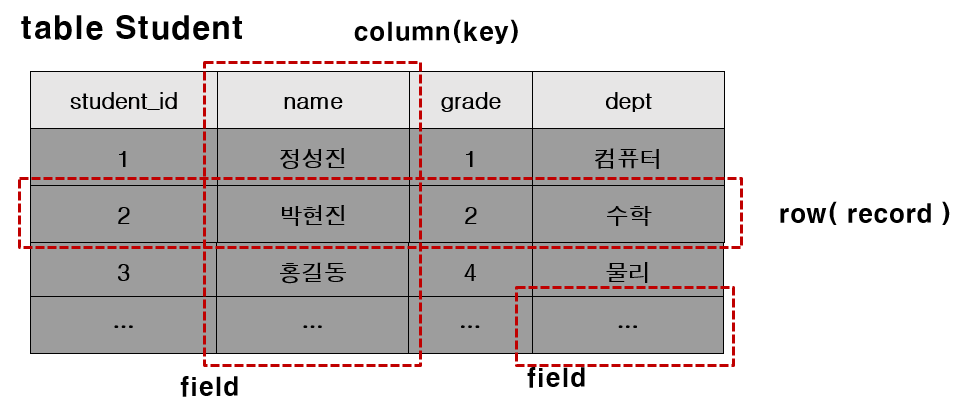
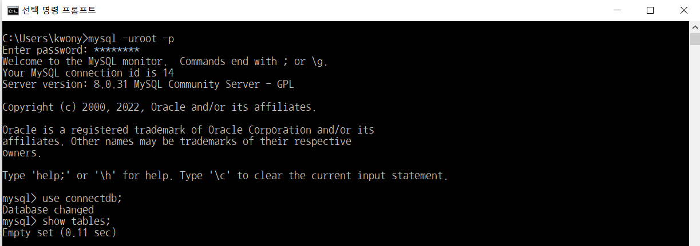
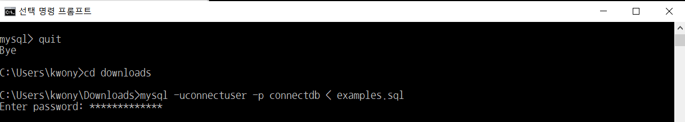
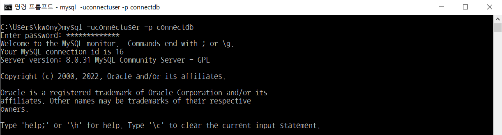
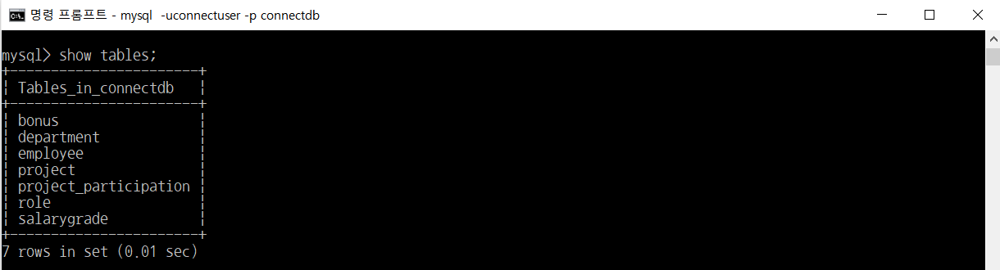
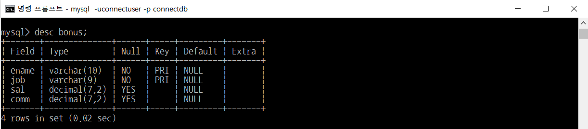
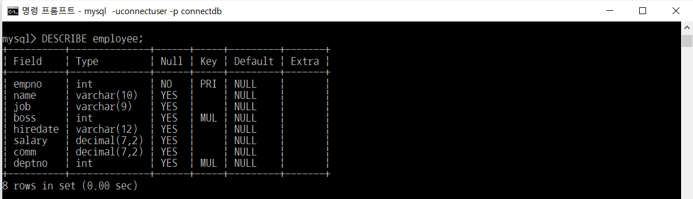

# SQL 테이블

> 부스트코스의 무료강의 중 웹 백엔드 강의를 수강하고 정리한 내용입니다.

[부스트코스 사이트](https://www.boostcourse.org/opencourse)

<br>

---

<br>

## **테이블(table)의 구성요소**



- **테이블** : RDBMS의 기본적 저장구조 한 개 이상의 column과 0개 이상의 row로 구성
- **열(Column)**
    - 테이블 상에서의 단일 종류의 데이터를 나타냄
    - 특정 데이터 타입 및 크기를 가지고 있음
- **행(Row)**
    - Column들의 값의 조합
    - 레코드라고 불림
    - 기본키(PK)에 의해 구분
    - 기본키는 중복을 허용하지 않으며 없어서는 안 됨
- **Field** : Row와 Column의 교차점으로 Field는 데이터를 포함할 수 있고, 없을 때는 NULL 값을 가지고 있음

<br>

---

<br>

## **현재 데이터베이스에 존재하는 테이블 목록 확인하기**

Database를 선택 후, Database의 전체 테이블 목록 출력



"empty set"은 데이터베이스에 어떤 테이블도 아직 생성되지 않았다는 것을 의미

<br>

## **SQL 연습을 위한 테이블 생성과 값의 저장**

<Br>

1\. 부스트코스 강의 중 `웹 백엔드 > 1) SQL이란?-2` 에 첨부되어 있는 examples.sql 다운로드 [링크](https://www.boostcourse.org/web326/lecture/258482?isDesc=false)

<br>

2\. 터미널에서 examples.sql이 있는 폴더로 이동한 후,

```
`mysql -uconnectuser -p connectdb < examples.sql` 입력
```

<br>

3\. 암호 입력 ( 암호 : connect123!@# )



> example.sql 에는 예제 테이블 생성문과 해당 테이블에 값을 저장하는 입력문 존재

<br>

4\. 새로운 명령프롬프트를 열어서 connectdb에 접속



<br>

5\. 접속한 db의 데이터 목록 보기



<br>

---

<br>

## **테이블의 구조를 확인하기 위한 DESCRIBE 명령**

table 구조를 확인하려면 `DESCRIBE` 명령 사용

( `DESC` 라고 사용해도 됨 )



