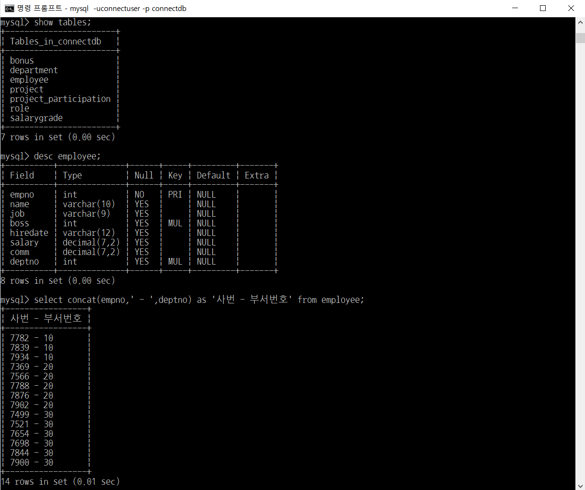
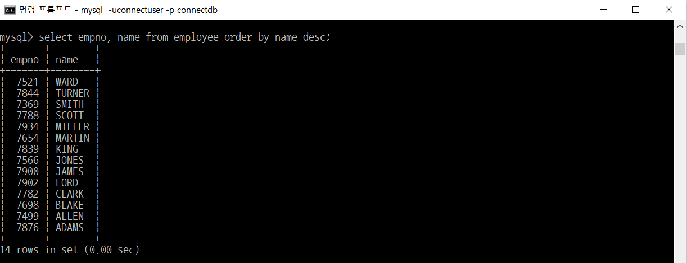

# MySQL - DML(select, insert, update, delete) (1/4)

> 부스트코스의 무료강의 중 웹 백엔드 강의를 수강하고 정리한 내용입니다.

[부스트코스 사이트](https://www.boostcourse.org/opencourse)

<br>

---

<br>

## **데이터 조작어(Data Manipulation Language, DML)의 종류**

데이터 조작어는 모두 동사로 시작

시작하는 동사에 따라서 다음과 같은 4가지 조작어가 있음

- `SELECT` – 검색
- `INSERT` – 등록
- `UPDATE` – 수정
- `DELETE` – 삭제

<br>

---

<br>

## **SELECT**

### **SELECT 구문의 기본문형**

```
SELECT (DISTINCT) 칼럼명 (ALIAS) FROM 테이블명;
```

- `SELECT`
    - 검색하고자 하는 데이터(칼럼)을 나열해라
    - 필수 O
- `DISTINCT`
    - 중복행을 제거해서 보여줘라
    - 필수 X
- `칼럼명`
    - 검색할 칼럼을 적으면 됨
    - 여러 개 나열 가능 (콤마로 구분)
    - `*` 을 기술하면 전체 데이터를 검색할 수 있음
    - 필수 O
- `ALIAS`
    - 나타날 칼럼에 대한 다른 이름 부여
    - `칼럼명 다른이름` 또는 `칼럼명 as 다른이름` 으로 작성하면 됨
    - 다른 이름에 공백이 포함된 경우 따옴표로 묶어주어야 함  
      `칼럼명 '다른 이름'`
    - 필수 X
- `FROM`
    - 선택한 칼럼이 있는 테이블 명시
    - 필수 O

<br>

### **SELECT 구문 예제 (전체 데이터 검색)**

SELECT 뒤에 `*` 를 기술함으로써 나타낼 수 있음

> 예제) department 테이블의 모든 데이터를 출력하시오.


<br>

### **SELECT 구문 예제 (특정 칼럼 검색)**

SELECT 뒤에 칼럼을 콤마(,)로 구별해서 나열

(어떤 칼럼이 있는지는 `DESC` 명령으로 확인)

> 예제1) department 테이블에서 부서명(deptno)을 출력하시오.  

> 예제2) department 테이블에서 부서명(deptno)과 위치(location)을 출력하시오.


<br>

### **SELECT 구문 예제 (칼럼에 Alias 부여하기)**

칼럼에 대한 ALIAS(별칭)을 부여해서 나타내는 칼럼의 HEADING 변경 가능

`칼럼명 별칭` 또는 `칼럼명 as 별칭` 으로 작성하면 됨

사용할 별칭에 공백이 포함된 경우 따옴표로 묶어주어야 함

> 예제1) department 테이블에서 부서명(deptno)과 위치(location)을 출력하시오.  

> 예제2) department 테이블에서 부서명(deptno)과 위치(location)을 출력하시오. (별칭으로)


<br>

### **SELECT 구문 예제 (칼럼의 합성 (Concatenation))**

문자열 결합함수 `concat` 사용

> 예제) employee 테이블에서 사번과 부서번호를 하나의 칼럼으로 출력하시오.



<br>

### **SELECT 구문 예제 (중복행 제거)**

중복되는 행이 출력되는 경우, `DISTINCT` 키워드로 중복행 제거

> 예제1) 사원 테이블의 모든 부서번호 출력하시오. (사원 수 만큼 출력된다.)  

> 예제2) 사원 테이블의 부서번호를 중복되지 않게 출력하시오.


<br>

### **SELECT 구문 예제 (정렬하기)**

```
SELECT (DISTINCT) 칼럼명 (ALIAS) FROM 테이블명 ORDER BY 칼럼·표현식 (ASC 또는 DESC);
```

- `ASC` : 오름차순 정렬 (기본값)
- `DESC` : 내림차순 정렬

> 예제1) employee 테이블에서 직원의 사번(empno), 이름(name)을 출력하시오. 

> 예제2) employee 테이블에서 직원의 사번(empno), 이름(name)을 이름을 기준으로 오름차순 정렬하여 출력하시오.  

> 예제3) employee 테이블에서 직원의 사번(empno), 이름(name)을 이름을 기준으로 내림차순 정렬하여 출력하시오.




<br>

사번 칼럼과 이름 칼럼을 검색했을 때 ( \`select empno, name from employee\` 를 했을 때 )

`empno` 칼럼이 1번째 칼럼이고, `name` 칼럼이 2번째 칼럼이므로

사번를 기준으로 정렬한 것과 이름을 기준으로 정렬한 것은 각각 다음과 같이 구문을 작성할 수 있다.

> 예제1) 사번(1번째 칼럼)을 기준으로 내림차순 정렬  

> 예제2) 이름(2번째 칼럼)을 기준으로 내림차순 정렬


