# MySQL - DML(select, insert, update, delete) (2/4)

> 부스트코스의 무료강의 중 웹 백엔드 강의를 수강하고 정리한 내용입니다.

[부스트코스 사이트](https://www.boostcourse.org/opencourse)

<br>

---

<br>

## **데이터 조작어(Data Manipulation Language, DML)의 종류**

데이터 조작어는 모두 동사로 시작

시작하는 동사에 따라서 다음과 같은 4가지 조작어가 있음

- SELECT – 검색
- INSERT – 등록
- UPDATE – 수정
-  DELETE – 삭제

<br>

---

<br>

## **SELECT**

### **SELECT 구문 예제 (특정 행 검색 - where절)**

```
SELECT (DISTINCT) 칼럼명 (ALIAS) 
FROM 테이블명 
WHERE 조건식
ORDER BY 칼럼이나 표현식 (ASC 또는 DESC)
```

- 조건식  
  : 칼럼이름이나 표현식의 상수, 연산자로 구성

<br>

**산술비교 연산자**

> 예제) employee 테이블에서 고용일(hiredate)이 1981년 이전의 사원이름과 고용일을 출력하시오.

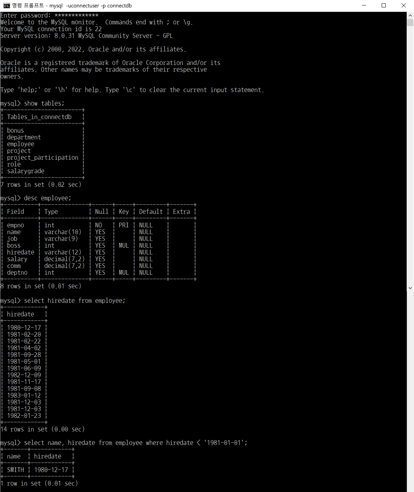

<br>

**논리연산자**  

> 예제1) employee 테이블에서 부서번호가 30인 사원이름과 부서번호를 출력하시오.

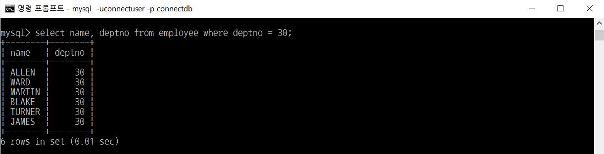

<br>

> 예제2) employee 테이블에서 직업이 MANAGER인 행의 모든 칼럼을 출력하시오.

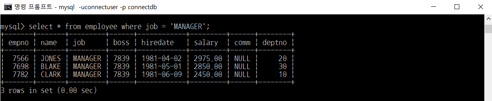

<br>

> 예제3) employee 테이블에서 부서번호가 10 또는 30인 사원이름과 부서번호를 출력하시오.

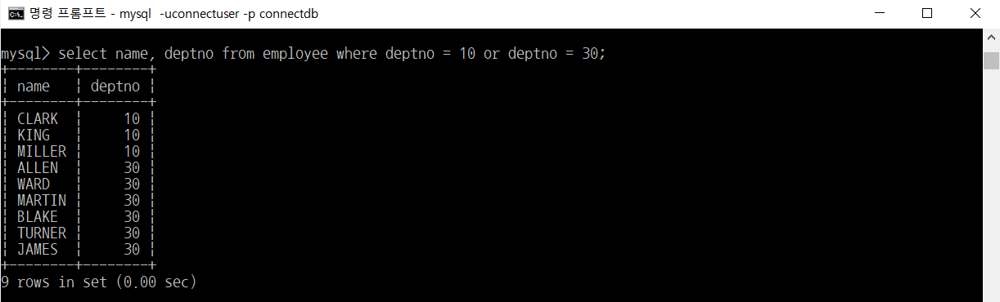

<br>

> 예제4) employee 테이블에서 부서번호가 10이고 급여가 3000보다 작은 사원의 사원이름, 부서번호, 급여를 출력하시오.


<br>

**IN 키워드**

> 예제) employee 테이블에서 부서번호가 10 또는 30인 사원이름과 부서번호를 출력하시오.

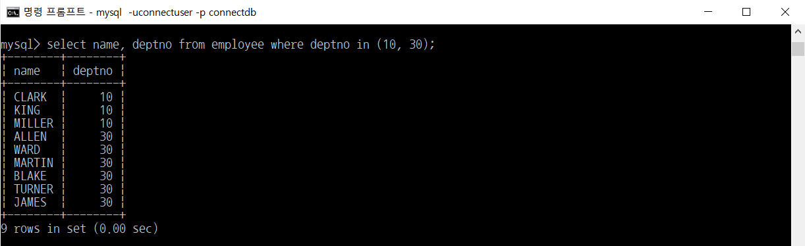

<br>

**LIKE 키워드**

와일드카드를 사용하여 특정 문자를 포함한 값에 대한 조건을 처리

- **%** : 0에서부터 여러 개의 문자열을 나타내는 와일드카드
- **\_** : 단 하나의 문자를 나타내는 와일드카드

<br>

> 예제1) employee 테이블에서 이름이 'A'로 시작하는 사원의 이름과 직업을 출력하시오.

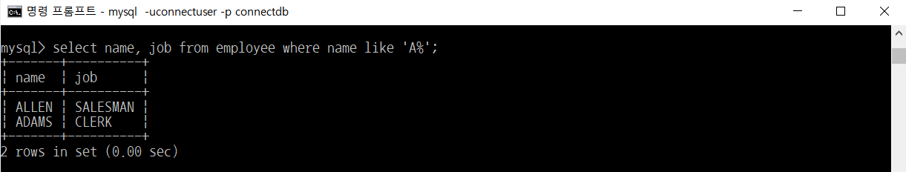

<br>

> 예제2) employee 테이블에서 이름에 'A'가 포함된 사원의 이름과 직업을 출력하시오.

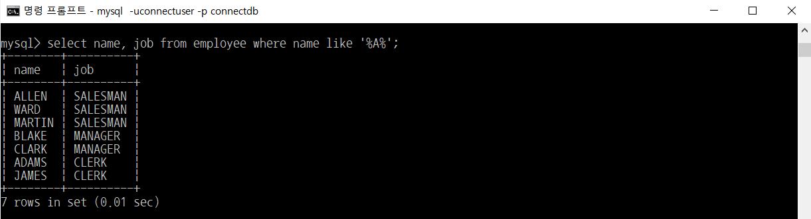

<br>

> 예제3) employee 테이블에서 이름의 두 번째 글자가 'A'인 사원의 이름과 직업을 출력하시오.

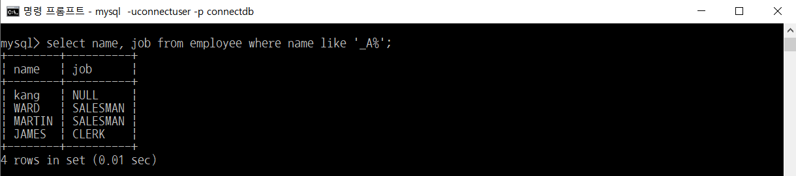

<br>

### **SELECT 구문 예제 (함수의 사용)**

참고) \`FROM 테이블\`이 없을 경우에는 테이블에서 조회하는 것이 아님

- **UCASE, UPPER**  
  : 문자열의 모든 문자를 대문자로 바꿈  
  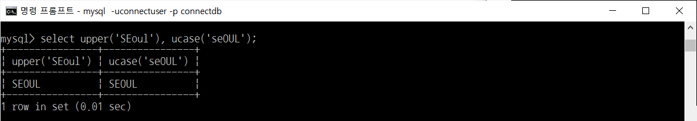

- **LCASE, LOWER**  
  : 문자열의 모든 문자를 소문자로 바꿈  
  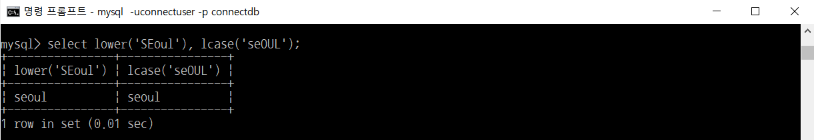

- **substring('문자열', n, m)**  
  : 문자열의 부분문자열을 구함  
    - n은 시작인덱스, m은 문자 개수  
    - 인덱스는 **1**부터 시작  
    - '문자열'의 n번째 인덱스부터 m개의 글자 반환  
  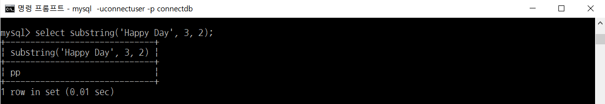

- **LPAD('문자열', n, '문자'), RPAD('문자열', 숫자, '문자')**  
  : n글자로 '문자열' 출력하되, 빈 공간은 '문자'로 채움  
    (LPAD는 왼쪽에 채우고, RPAD는 오른쪽에 채움)  
  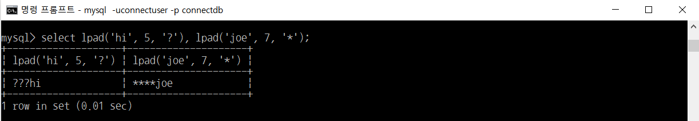

- **TRIM, LTRIM, RTRIM**  
  : TRIM은 좌우공백 제거, LTRIM은 왼쪽 공백 제거, RTRIM은 오른쪽 공백 제거  
  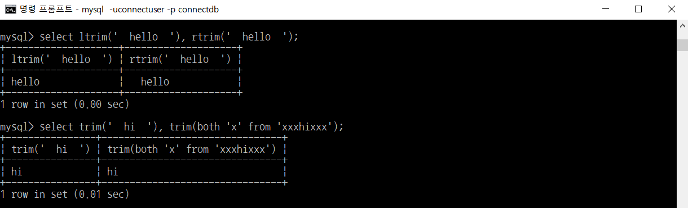

- **ABS(x)**  
  : x의 절대값 반환  
  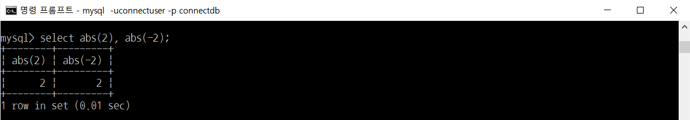

- **MOD(n, m) , %**  
  : n을 m으로 나눈 나머지 값 반환  
  

- **FLOOR(x)**  
  : x보다 크지 않은 가장 큰 정수 반환 (BIGINT로 자동 변환)  
  

- **CEILING(x)**  
  : x보다 작지 않은 가장 큰 정수 반환  
  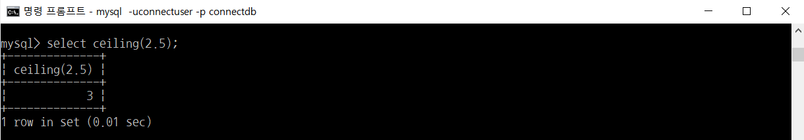

- **ROUND(x)**  
  : x에 가장 근접한 정수 반환 (x를 반올림한 값)  
  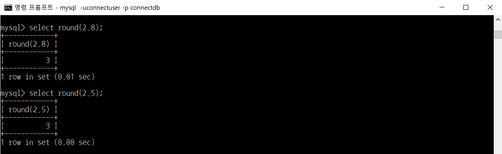

- **POW(x, y), POWER(x, y)**  
  : x의 y제곱 반환  
  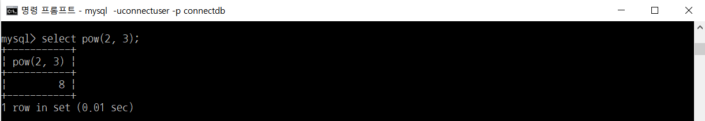

- **GREATEST(x, y, ...)**  
  : 가장 큰 값 반환  
  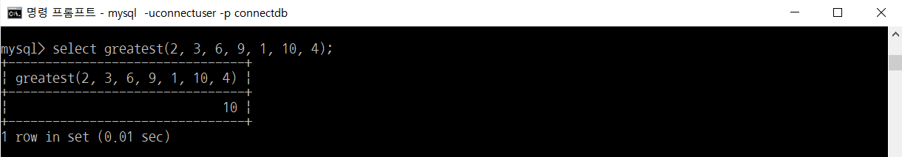

- **LEAST(x, y, ...)**  
  : 가장 작은 값 반환  
  