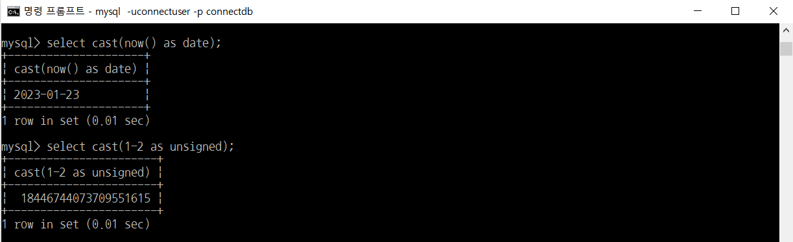
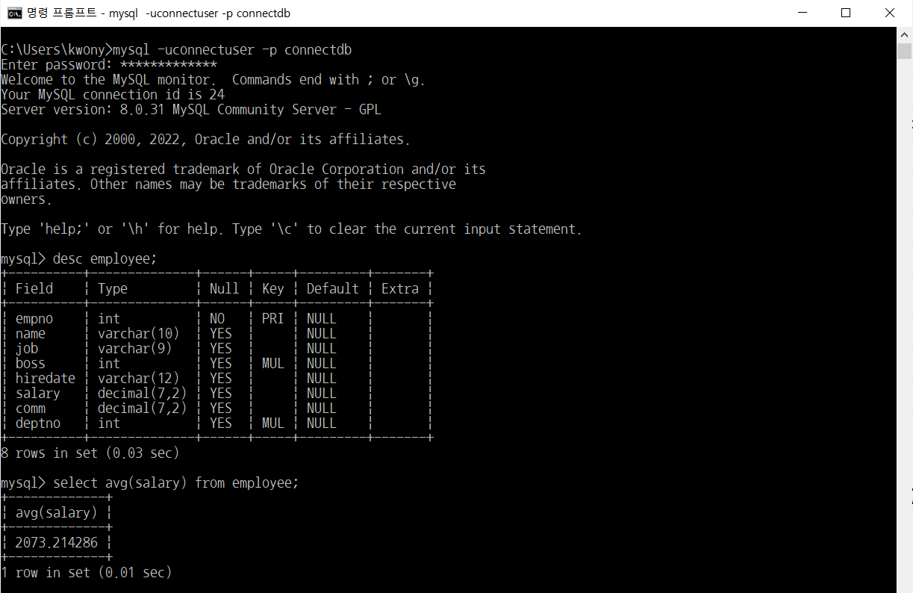
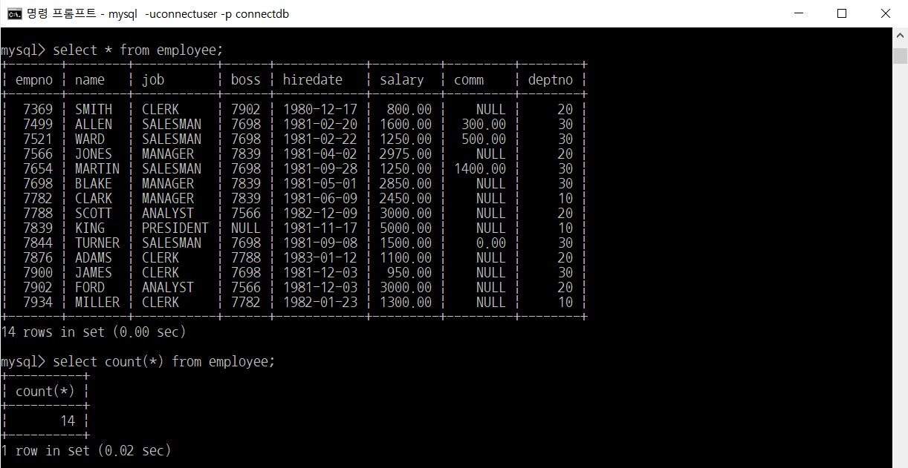
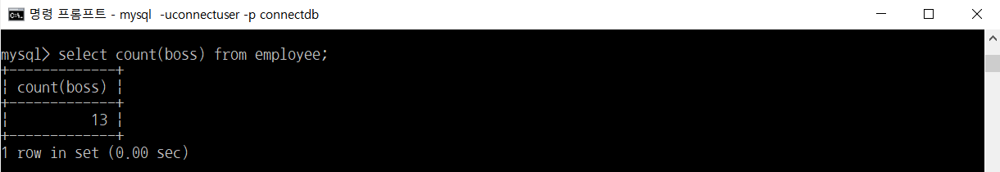
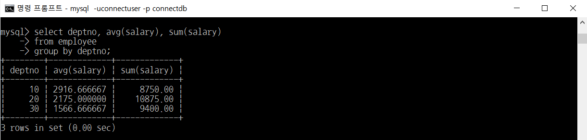

# MySQL - DML(select, insert, update, delete) (3/4)

> 부스트코스의 무료강의 중 웹 백엔드 강의를 수강하고 정리한 내용입니다.

[부스트코스 사이트](https://www.boostcourse.org/opencourse)

 

---

 

## **데이터 조작어(Data Manipulation Language, DML)의 종류**

데이터 조작어는 모두 동사로 시작

시작하는 동사에 따라서 다음과 같은 4가지 조작어가 있음

- SELECT – 검색
- INSERT – 등록
- UPDATE – 수정
- DELETE – 삭제

 

---

 

## **SELECT**

### **SELECT 구문 (CAST 형변환)**

CAST 함수는 type을 변경(지정)하는 데 유용

`CAST (expression AS type)` 또는 `CONVERT(expression, type)`

 

type 종류

- BINARY
- CHAR
- DATE
- DATETIME
- SIGNED &nbsp; &nbsp; &nbsp; &nbsp; {INTEGER}
- TIME
- UNSIGNED &nbsp; &nbsp; &nbsp; &nbsp; {INTEGER}

 

### **SELECT 구문 (그룹함수)**

| **COUNT(expr)** | non-NULL인 row의 개수 반환 |
| --- | --- |
| **COUNT (DISTINCT expr, \[expr...\]** | non-NULL인 중복되지 않은 row의 개수 반환 |
| **COUNT(\*)** | row의 개수 반환 |
| **AVG(expr)** | expr의 평균값 반환 |
| **MIN(expr)** | expr의 최소값 반환 |
| **MAX(expr)** | expr의 최대값 반환 |
| **SUM(expr)** | expr의 합계 반환 |
| **GROUP\_CONCAT(expr)** | 그룹에서 concatenated한 문자 반환 |
| **VARIANCE(expr)** | 분산 |
| **STDDEV(expr)** | expr의 표준편차 반환 |

 

### **SELECT 구문 예제 (그룹함수)**

> 예제1) employee 테이블에서 급여의 평균을 출력하시오.

 

> 예제2) employee 테이블의 행의 개수를 출력하시오.

 

> 예제3) employee 테이블에서 boss 행의 개수를 출력하시오.

( NULL인 행은 제외되므로 13개임)

 

> 예제4) employee 테이블에서 부서번호가 30인 직원의 급여 평균과 총합계를 출력하시오.

 

### **SELECT 구문 예제 (그룹함수와 groupby절)**

> 예제) employee 테이블에서 부서별 직원의 부서번호, 급여 평균과 총합계를 출력하시오.

