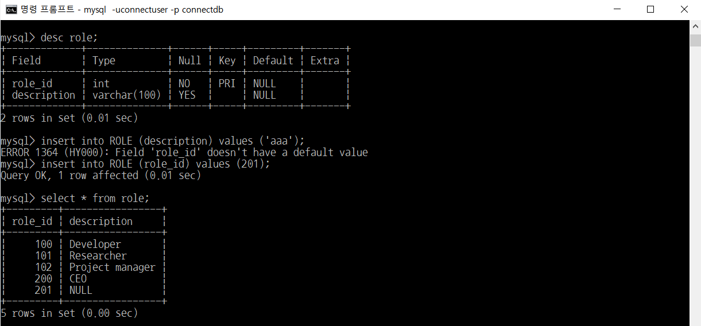
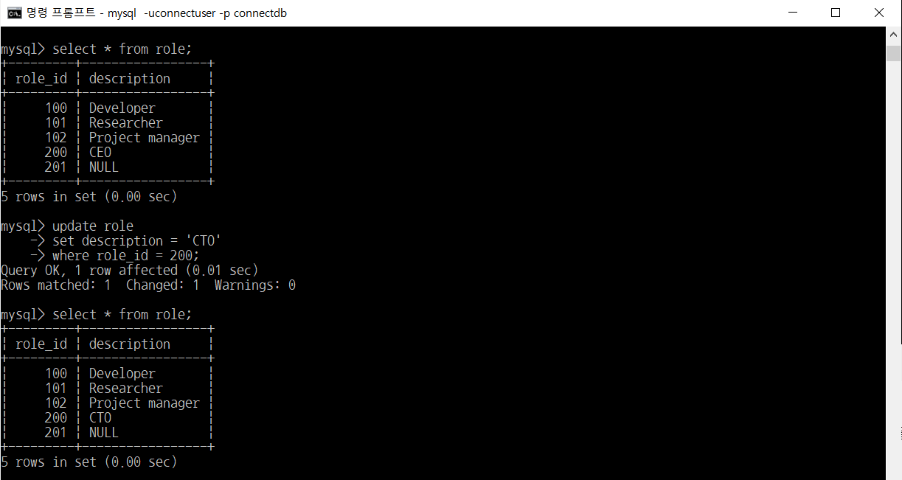
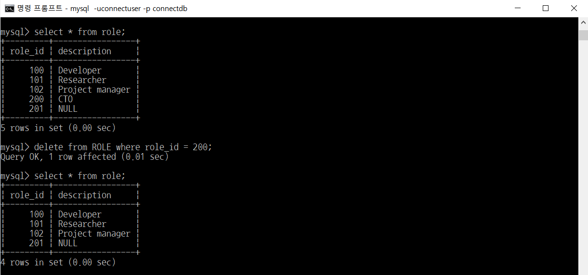

# MySQL - DML(select, insert, update, delete) (4/4)

> 부스트코스의 무료강의 중 웹 백엔드 강의를 수강하고 정리한 내용입니다.

[부스트코스 사이트](https://www.boostcourse.org/opencourse)

<br>

---

<br>

## **데이터 조작어(Data Manipulation Language, DML)의 종류**

데이터 조작어는 모두 동사로 시작

시작하는 동사에 따라서 다음과 같은 4가지 조작어가 있음

-   SELECT – 검색
-   INSERT – 등록
-   UPDATE – 수정
-   DELETE – 삭제

<br>

---

<br>

## **INSERT**

### **데이터 입력 (INSERT문)**

```
INSERT INTO 테이블명 (필드1, 필드2, 필드3, 필드4, ··· )
    VALUES (필드1의 값, 필드2의 값, 필드3의 값, 필드4의 값, ··· );
    
INSERT INTO 테이블명
    VALUES (필드1의 값, 필드2의 값, 필드3의 값, 필드4의 값, ··· );
```

-   필드명을 지정해주는 방식에서 디폴트 값이 세팅되는 필드는 생략 가능
-   필드명을 생략했을 경우에는 모든 필드 값을 반드시 입력해야 함

<br>

### **데이터 입력 실습 (INSERT문)**

> 예제) ROLE테이블에 role\_id는 200, description에는 'CEO'로 한건의 데이터를 저장하시오.


<br>

**주의할 점**



위의 실행에서 `insert into ROLE (description) values ('aaa');`에서 에러가 발생한 이유

→ `desc role;` 해보면 role\_id 필드가 NULL값이 오면 안 되는 필드인데 값을 지정하지 않았기 때문

&nbsp; &nbsp; `insert into ROLE (role\_id) values (201);` 는 잘 실행됨

→ `desc role;` 했을 때 description 필드는 NULL값이 와도 되는 필드이기 때문에 에러가 발생하지 않음

<br>

## **UPDATE**

### **데이터 수정 (UPDATE문)**

```
UPDATE 테이블명
    SET 필드1=필드1의값, 필드2=필드2의값, 필드3=필드3의값, ···
  WHERE 조건식
```

-   조건식을 통해 특정 row만 변경 가능
-   조건식을 주지 않으면 전체 row의 값이 수정되므로 조심해야 함

<br>

### **데이터 수정 실습 (UPDATE문)**

> 예제) ROLE테이블에 role\_id가 200일 경우 description을 'CTO'로 수정하시오.



<br>

## **DELETE**

### **데이터 삭제 (DELETE문)**

```
DELETE FROM 테이블명 WHERE 조건식
```

-   조건식을 통해 특정 row만 삭제 가능
-   조건식을 주지 않으면 전체 row가 삭제되므로 조심해야 함

<br>

### **데이터 삭제 실습 (DELETE문)**

> 예제) ROLE테이블에서 role\_id는 200인 정보를 삭제하시오.


