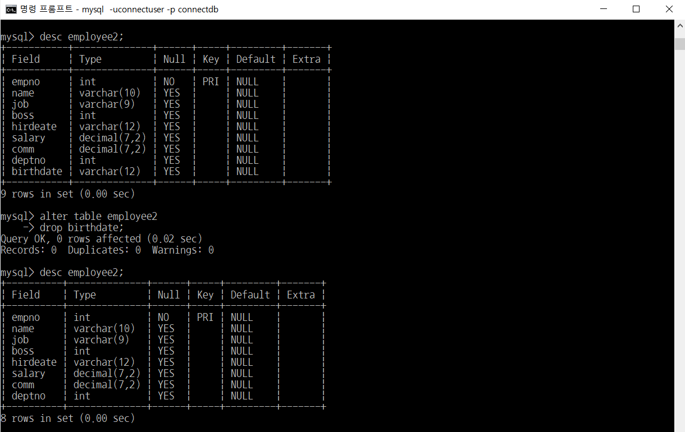
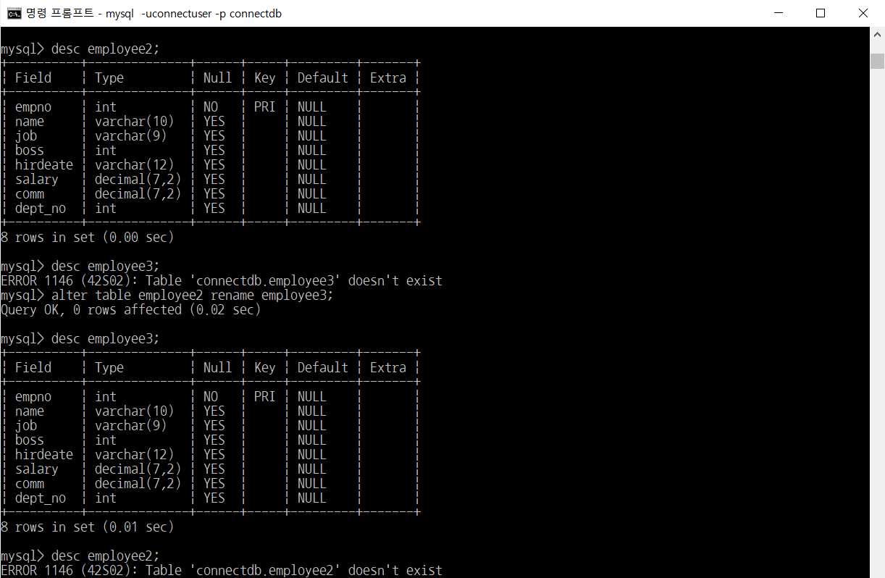

# MySQL - DDL(create, drop)

> 부스트코스의 무료강의 중 웹 백엔드 강의를 수강하고 정리한 내용입니다.

[부스트코스 사이트](https://www.boostcourse.org/opencourse)

<br>

---

<br>

## **데이터 정의어(Data Definition Language, DML)**

데이터베이스의 스키마 객체를 생성하거나 변경하거나 제거하는 등의 일을 수행

<br>

---

<br>

### **MySQL 데이터 타입**

| TINYINT(M) | 부호 있는 수는 -128 부터127 까지,   부호 없는 수는 0 부터 255 까지의 수 표현.   1 바이트 |
| --- | --- |
| SMALLINT(M) | 부호 있는 수는 -32,768 부터 32,767 까지,   부호 없는 수는 0 부터 65,535 까지의 수 표현.   2 바이트 |
| MEDIUMINT(M) | 부호 있는 수는 -8,388,608 부터 8,388,607 까지,   부호 없는 수는 0 부터 16,777,215 까지의 수 표현.   3 바이트 |
| INT(M) or INTEGER(M) | 부호 있는 수는 -2,147,483,648 부터 2,147,483,647 까지,   부호 없는 수는 0 부터 4,294,967,295 까지의 수 표현.   4 바이트 |
| BIGINT(M) | 부호 있는 수는 -9,223,372,036,854,775,808 부터 9,223,372,036,854,775,807 까지,   부호 없는 수는 0 부터 18,446,744,073,709,551,615 까지의 수 표현.   8 바이트 |
| FLOAT(M,D) | 부호가 있는 부동 소수점을 나타냄   \-3.402823466E+38 부터 3.402823466E+38 까지의 수 표현 |
| DOUBLE(M,D) | 2배 정밀도를 가진 부동 소수점을 나타냄   \-1.79769313486231517E+308 부터 1.79769313486231517E+308 까지의 수 표현 |
| DATE | 날짜를 표현하는 타입   ex) '9999-12-31'   3 바이트 |
| DATETIME | 날짜와 시간을 같이 나타내는 타입   ex) '9999-12-31 23:59:59'   8 바이트 |
| TIMESTAMP | '1070-01-01 00:00:00' 부터 2037년까지 나타낼 수 있음   4 바이트 |
| TIME | 시간을 나타내는 타입   '-839:59:59' 부터 '838:59:59' 까지 나타낼 수 있음 |
| YEAR | 년도를 나타내는 타입   1901년부터 2155년, 0000년을 나타낼 수 있음 |
| CHAR(M) | 고정 길이를 갖는 문자열 저장 가능   M은 1 ~ 255 |
| VARCHAR(M) | CHAR는 고정 길이인 반면, VARCHAR은 가변 길이 |
| TINYBLOB,   TINYTEXT | 255개의 문자 저장 가능 |
| BLOB,   TEXT | 65,535개의 문자 저장 가능 |
| MEDIUMBLOB,   MEDIUMTEXT | 16,777,215개의 문자 저장 가능 |
| LONGBLOB,   LONGTEXT | 4,294,967,295개의 문자 저장 가능 |

<br>

---

<br>

### **테이블 생성**

```
create table 테이블명( 
    필드명1 타입 [NULL | NOT NULL][DEFAULT ][AUTO_INCREMENT], 
    필드명2 타입 [NULL | NOT NULL][DEFAULT ][AUTO_INCREMENT], 
    필드명3 타입 [NULL | NOT NULL][DEFAULT ][AUTO_INCREMENT], 
    ........... 
    PRIMARY KEY(필드명) 
    );
```

-   데이터 형 외에도 속성값의 빈 값 허용 여부는 NULL 또는 NOT NULL로 설정
-   DEFAULT 키워드와 함께 입력하지 않았을 때의 초기값 지정
-   입력하지 않고 자동으로 1씩 증가하는 번호는 AUTO\_INCREMENT

<br>

> 예제) EMPLOYEE와 같은 구조를 가진 EMPLOYEE2 테이블 생성


<br>

### **테이블 수정 (칼럼 추가/삭제)**

```
ALTER TABLE 테이블명
    ADD 필드명 타입 [NULL | NOT NULL][DEFAULT][AUTO_INCREMENT];
    
ALTER TABLE 테이블명
    DROP 필드명;
```

<br>

> 예제1) EMPLOYEE2 테이블에 생일(birthdate)칼럼을 varchar(12)형식으로 추가하시오.


<br>

> 예제2) EMPLOYEE2 테이블의 생일(birthdate) 칼럼을 삭제하시오.



<br>

### **테이블 수정 (칼럼 수정)**

```
alter table 테이블명
    change 필드명 새필드명 타입 [NULL | NOT NULL][DEFAULT ][AUTO_INCREMENT];
```

<br>

### **테이블 수정 실습 (칼럼 수정)**

> 예제) EMPLOYEE2 테이블의 부서번호(deptno)를 dept\_no로 수정하시오. ( 형식은 int(11) )


<br>

### **테이블 이름 변경**

```
alter table 테이블명 rename 새테이블명;
```

<br>

### **테이블 이름 변경 실습**

> 예제) EMPLOYEE2 테이블의 이름을 EMPLOYEE3로 변경하시오.



<br>

### **테이블 삭제하기**

```
drop table 테이블명;
```

참고로, 제약 조건이 있을 경우에는 drop table 명령으로도 테이블이 삭제되지 않을 수 있음

이때는 테이블을 생성한 반대 순서로 삭제해야 함

제약 조건의 예로는 다음과 같은 상황이 있음


여기서 insert가 되지 않는 이유는,

department 테이블의 deptno와 employee 테이블의 deptno가 서로 관계를 맺고 있기 때문.

즉, department 테이블의 deptno에 없는 숫자를 employee테이블의 deptno에 넣으려고 했기 때문에 에러 발생


다시 말해, deptno에는 10, 20, 30, 40만 있는데, deptno가 100인 row를 만드려고 했기 때문에 에러가 발생한 것임

추가하려는 row의 deptno를 30으로 바꾸면 제대로 실행됨


에러가 나지 않음

이처럼 두 개 이상의 테이블이 관계를 맺고 있는 경우에는 먼저 만들어진 테이블(위의 경우 department 테이블)을 삭제할 수 없고, 나중에 만들어진 테이블(위의 경우 employee테이블)부터 삭제한 후에야 삭제할 수 있음

(위의 경우 employee 테이블을 삭제한 후 department 테이블을 삭제해야 함)

<br>

### **테이블 삭제 실습**

> 예제) EMPLOYEE3 테이블을 삭제하시오


